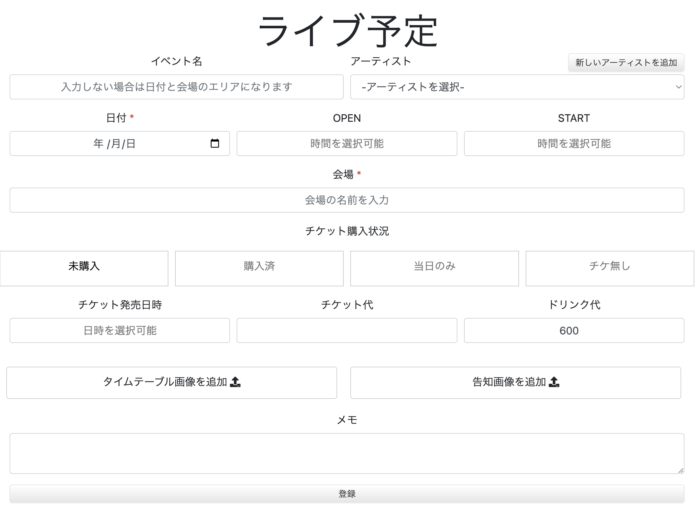
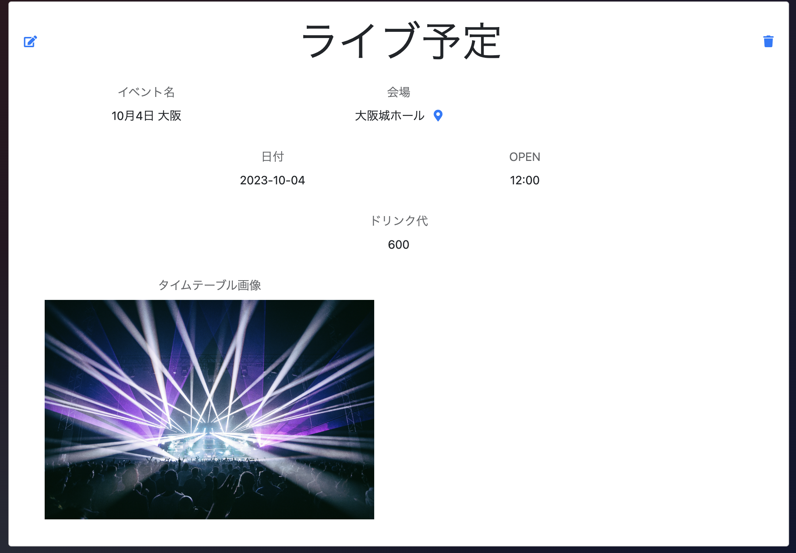
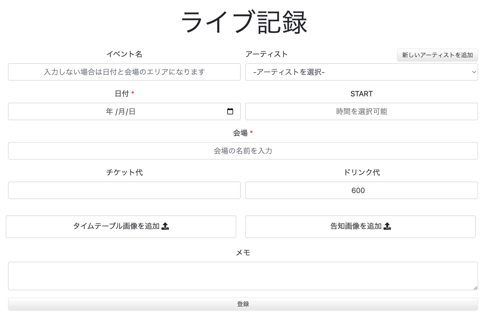
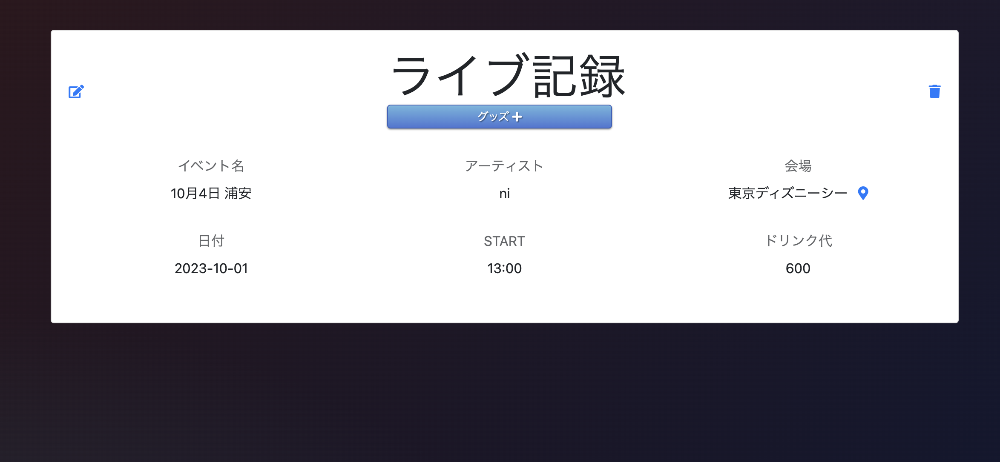
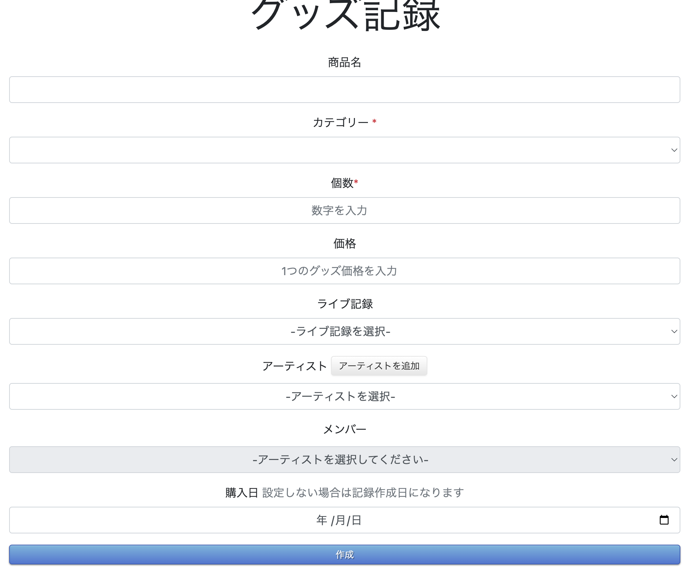
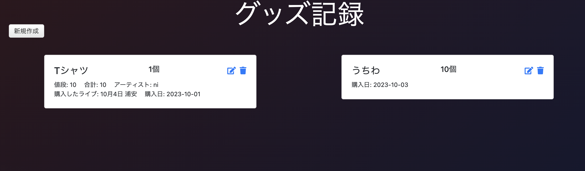

Livehubはライブのファン向けの記録WEBアプリです。
ライブ予定、ライブ記録、グッズ記録、アーティスト登録、統計表示が可能です。

ポートフォリオのアイデアに悩んでいたところ、元々ライブに行くことが趣味で、ライブ関係の情報を簡単に記録できるようなアプリがあれば良いと思い制作を始めました。
ライブが趣味の人は記録が好きな人も多く居て、TwitterなどのSNSよりターゲットを絞り専門的な機能を高めれば利用してもらえると考えました。

使用技術
HTML
CSS
JavaScript
JQuery
Bootstrap

Ruby v3.1.3p185
Rails v6.1.7.6
rspec v3.12
rubocop v1.56.3

Heoku
JawsDB MySQL

Git/GitHub
Google Maps API

日付と会場のみ必須
会場の入力にはGoogle PLACE APIのオートコンプリート機能を実装しています。
チケットの購入状況によって入力フィールドの表示を切り替えます。
(チケット発売日時、チケット代)

ライブ予定詳細ではGoogle mapへのリンクを用意しておりユーザーがクリックすることで位置が表示可能。

ライブ予定は予定日の当日にライブ記録にコピーされ、その後に自動的に削除されます。(削除は深夜のイベントにも対応するために翌日のAM.3時頃)
(Heroku schedualerによる定期処理）

ライブ予定は基本的にはライブ予定と同じですが、チケットの購入状況など予定と記録で少し異なります。

ライブ記録詳細画面からグッズ記録作成ページへ飛ぶことによってグッズ記録作成ページで自動的にライブが選択されます。

カテゴリーと数が必須で他は任意。
カテゴリーはその他を選択すれば任意のカテゴリーを保存可能で、またカテゴリーは最後に使われた順になっています。(その他を選択することも可能) 
他にもグッズ記録は様々情報を紐づけることが可能です。
アーティストを選択することでそのアーティストに紐付いたメンバーを選択することが可能になります。
またライブ記録に日付と、アーティストが選択されていればそのアーティストが自動的に選択されます。

グッズ記録一覧ページでは情報と紐付けられたライブ、アーティスト、メンバーなどが表示されます

統計ではライブ記録とグッズ記録を元にライブや支出、アーティストなどの項目が表示可能です。
chart.jsを使用し棒グラフと円グラフを表示しています。

またアーティスト登録では、ニックネームとニックネーム表示モードがあり切り替えることが可能です。
ジャンルやメンバーなどは統計でも使用されます。

ハートマークをクリックすることでお気に入りの追加、削除ができます。

アーティスト一覧ページではアーティスト名とニックネームを表示し
お気に入りのアーティスト一覧へ切り替えることが可能です

今後実装したいもの
天気予報APIでライブ当日の天気予報を表示
ライブ記録で演奏曲などを簡単に追加できるように
食べたご飯や泊まった場所なども記録機能
場所へのチェックイン
アーティスト別やメンバー別の統計

