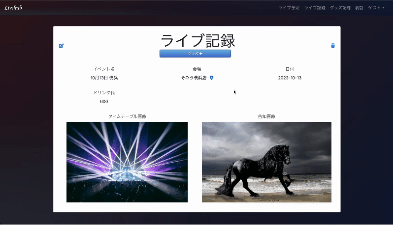

# Livehub - ライブのファン向けの記録WEBアプリ

**ライブ予定、ライブ記録、グッズ記録、アーティスト登録、統計表示**が可能なアプリです。

https://livehub-44b32f9de40f.herokuapp.com

## 背景

ライブが趣味の人は記録が好きな人も多く、SNSよりも**専門的な機能**を高めれば利用してもらえると考えました。このアイディアはライブに行くことが趣味であり、ライブ関連の情報を簡単に記録できるアプリがあれば良いと思ったことから生まれました。

## 使用技術

| 項目             | 技術                     |
|------------------|--------------------------|
| フロントエンド   | HTML, CSS, JavaScript, JQuery, Bootstrap |
| バックエンド     | Ruby v3.1.3, Rails v6.1.7.6 |
| テスト           | Rspec v3.12 |
| コード品質       | Rubocop v1.56.3 |
| デプロイ         | Heoku |
| データベース     | JawsDB MySQL |
| バージョン管理   | Git/GitHub |
| 外部API         | Google Maps API. OpenWeather API |

## ER図

## 機能一覧

| 機能名                   | 説明                                                                                     |
|--------------------------|------------------------------------------------------------------------------------------|
| ログイン機能             | Deviseを使用                                                                             |
| ユーザー設定             | ユーザーネームと画像の設定                                                               |
| アーティスト登録         | 名前、ニックネーム、ジャンル、画像、結成日、初ライブ日、メモの設定可能                     |
| アーティスト設定           | アーティストをお気に入り登録、ニックネーム表示切り替え機能                               |
| ライブ予定登録           | イベント名、日付、アーティスト、会場等の詳細設定                                         |
| 会場情報                 | Google PLACE APIのオートコンプリート使用、エリア自動設定                                 |
| 天気予報表示機能        | ライブ予定詳細ページで5日前から当日の天気、温度、降水確率を確認可能                        |
| ライブ記録の移行              | Heoku Schedulerの定期処理                                                     |
| グッズ登録               | グッズ名、カテゴリー、価格、ライブ記録、アーティスト、メンバーへ紐付け                                                   |
| 統計情報                 | ライブとグッズの支出、ライブの回数、アーティスト数等の集計とグラフ                               |
| グラフ表示               | Chart.js 棒グラフと円グラフ                  |

## その他機能詳細

 

ハートマークをクリックでお気に入りを切替、メンバーを削除アイコンで削除はAjaxで実装
    アーティストのニックネーム表示はページ全体で一元的に切り替え可能。
    アーティストのshowページでは、結成日と初ライブ日からの経過日数を表示。

ライブ予定、記録詳細には、会場へのGoogle Mapsのリンクを表示。
ライブ記録ではグッズ作成ページへのリンクもあり、グッズ記録でライブが自動選択される。

 グッズカテゴリーは、使用日順に表示され、その他を選択することで新しいカテゴリーを追加することも可能。
    グッズ記録一覧には、合計金額が表示される。

統計ページには、ライブの回数や支出、アーティストや会場のランキング等の情報が集約されて表示される。

## 今後実装したい機能

- ライブ記録で演奏曲などを簡単に追加機能
- 食べたご飯や泊まった場所なども記録機能
- アーティスト別やメンバー別の統計
- 通知機能
- カレンダー機能
